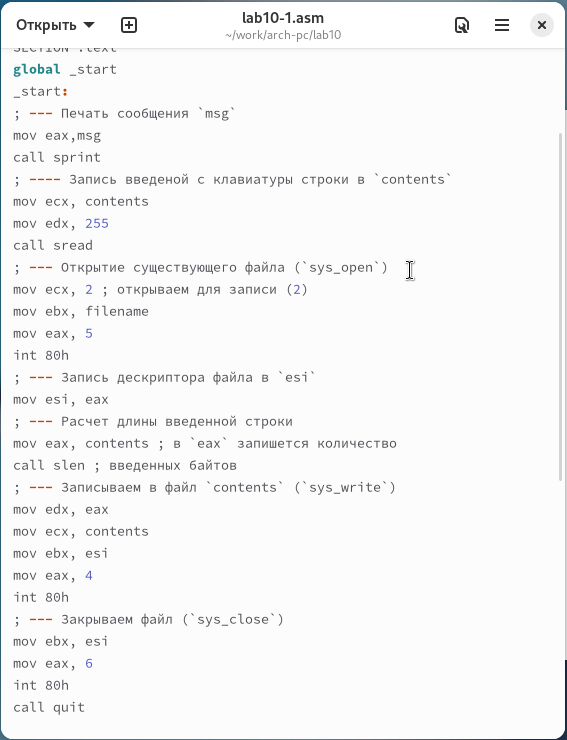
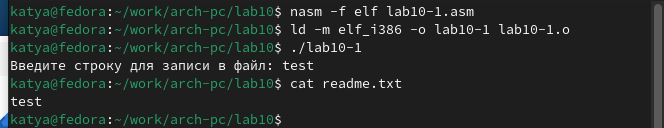
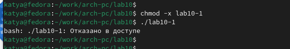
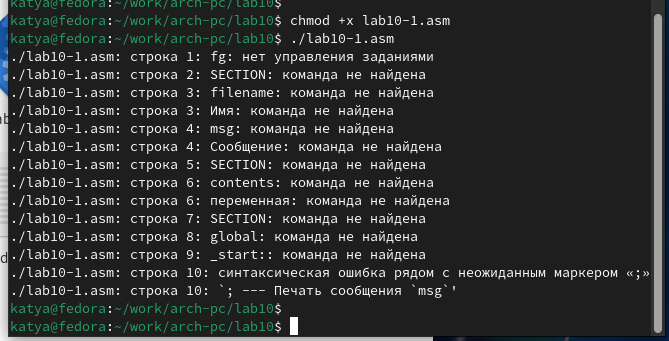
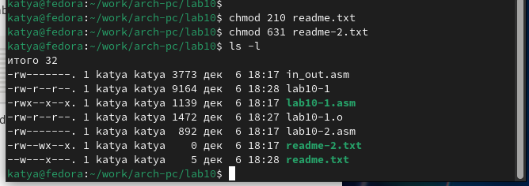
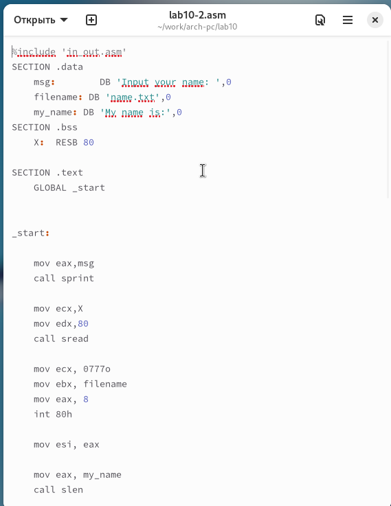
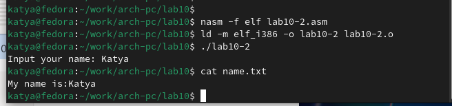

---
## Front matter
title: "Отчёт по лабораторной работе 10"
subtitle: "Архитектура компьютера"
author: "Цыкунова Екатерина Михайловна НКАбд-05-24"

## Generic otions
lang: ru-RU
toc-title: "Содержание"

## Bibliography
bibliography: bib/cite.bib
csl: pandoc/csl/gost-r-7-0-5-2008-numeric.csl

## Pdf output format
toc: true # Table of contents
toc-depth: 2
lof: true # List of figures
lot: true # List of tables
fontsize: 12pt
linestretch: 1.5
papersize: a4
documentclass: scrreprt
## I18n polyglossia
polyglossia-lang:
  name: russian
  options:
	- spelling=modern
	- babelshorthands=true
polyglossia-otherlangs:
  name: english
## I18n babel
babel-lang: russian
babel-otherlangs: english
## Fonts
mainfont: PT Serif
romanfont: PT Serif
sansfont: PT Sans
monofont: PT Mono
mainfontoptions: Ligatures=TeX
romanfontoptions: Ligatures=TeX
sansfontoptions: Ligatures=TeX,Scale=MatchLowercase
monofontoptions: Scale=MatchLowercase,Scale=0.9
## Biblatex
biblatex: true
biblio-style: "gost-numeric"
biblatexoptions:
  - parentracker=true
  - backend=biber
  - hyperref=auto
  - language=auto
  - autolang=other*
  - citestyle=gost-numeric
## Pandoc-crossref LaTeX customization
figureTitle: "Рис."
tableTitle: "Таблица"
listingTitle: "Листинг"
lofTitle: "Список иллюстраций"
lotTitle: "Список таблиц"
lolTitle: "Листинги"
## Misc options
indent: true
header-includes:
  - \usepackage{indentfirst}
  - \usepackage{float} # keep figures where there are in the text
  - \floatplacement{figure}{H} # keep figures where there are in the text
---

# Цель работы

Целью работы является приобретение навыков написания программ для работы с файлами.

# Выполнение лабораторной работы

Я создала каталог для лабораторной работы №10 и перешла в него. 
Внутри каталога, мною были созданы три файла: lab10-1.asm, readme-1.txt и readme-2.txt. 

В файле lab10-1.asm, я написала программу в соответствии с листингом 10.1, 
которая записывает сообщение в файл. 
После этого, я преобразовала этот код в исполняемый файл 
и проверила его функционирование.(рис. [-@fig:001]) 

{ #fig:001 width=70%, height=70% }

Эта программа запрашивает строку и перезаписывает её в файл readme.txt. 
Однако, если указанный файл не существует, он не будет создан и строка не запишется.
(рис. [-@fig:002])

{ #fig:002 width=70%, height=70% }

Для того чтобы запретить выполнение исполняемого файла lab10-1, 
я применила команду chmod для изменения прав доступа и убрала атрибут "x" во 
всех трех позициях. 

После этого, я попыталась запустить файл. 
Но файл не запускался, так как атрибут "x" был снят. (рис. [-@fig:003])

{ #fig:003 width=70%, height=70% }

Я изменила настройки доступа к файлу lab10-1.asm, добавив разрешение на его 
выполнение с использованием команды chmod. После этого, я попыталась запустить 
файл. (рис. [-@fig:004]) В итоге, файл был запущен, и терминал попытался 
интерпретировать его содержание как команды. Однако, поскольку это 
файл с кодом на языке ассемблера, а не команды для терминала, произошли ошибки. 

{ #fig:004 width=70%, height=70% }

Затем, я настроила права доступа к файлам readme в соответствии с указаниями 
в таблице 10.4. Чтобы убедиться в правильности выполнения, применила команду 
ls -l и вывела атрибуты. (рис. [-@fig:005])

для варианта 13: ```-w- --x ---``` ```110 011 001```

{ #fig:005 width=70%, height=70% }

## Самостоятельное задание

Написала программу работающую по следующему алгоритму (рис. [-@fig:006]) (рис. [-@fig:007]):

- Вывод приглашения “Как Вас зовут?”

- ввести с клавиатуры свои фамилию и имя

- создать файл с именем name.txt

- записать в файл сообщение “Меня зовут”

- дописать в файл строку введенную с клавиатуры

- закрыть файл

{ #fig:006 width=70%, height=70% }

{ #fig:007 width=70%, height=70% }

# Выводы

Освоили работy с файлами и правами доступа.